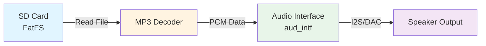
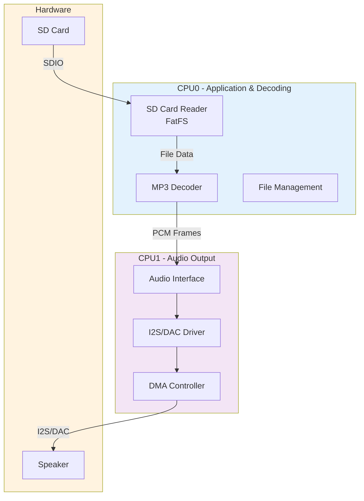
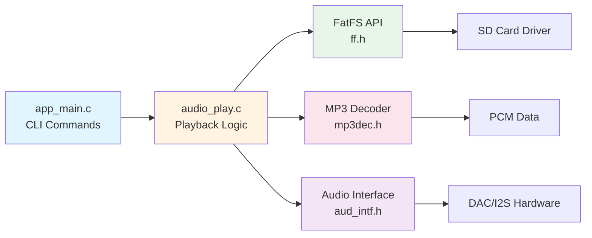
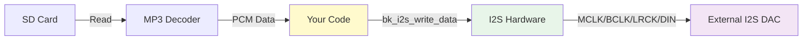

# SD Card Audio Playback - BK7258

Playing audio files from SD card via I2S/DAC output on BK7258

## Overview

This guide explains how to play audio files from an SD card through I2S/DAC output on the BK7258 chip. The SDK includes a complete demo project (`audio_play_sdcard_mp3_music`) that demonstrates MP3 playback, and this document will help you understand how it works and how to extend it for other audio formats.

### What You'll Learn

- 🎵 How the audio playback pipeline works (SD card → Decoder → I2S/DAC → Speaker)
- 🔧 Which APIs and components to use
- 📝 How to build and run the existing MP3 demo
- 🚀 How to quickly create your own audio player
- 🎯 How to add support for other audio formats (WAV, AAC, FLAC, etc.)

### Architecture Overview



The audio playback system consists of four main components:

1. **File System (FatFS)**: Reads audio files from SD card
2. **Audio Decoder**: Decodes compressed audio (MP3, etc.) to PCM
3. **Audio Interface (`aud_intf`)**: Manages audio hardware and I2S/DAC output
4. **Hardware Output**: Sends audio data to speaker via I2S or DAC

---

## Quick Start Guide

Follow these steps to quickly test MP3 playback on your BK7258 board.

### Prerequisites

**Hardware Requirements:**
- BK7258 core board (BK7258_QFN88_9X9_V3.2 or compatible)
- Speaker module (BK_Module_Speaker_V1.1 or compatible)
- PSRAM (8M or 16M)
- SD card (FAT32 formatted) with MP3 files

**Software Requirements:**
- Beken AVDK source code
- Toolchain installed and configured

### Build the Project

```bash
# Navigate to the SDK root
cd /path/to/bk_avdk

# Build for BK7258
make bk7258 PROJECT=media/audio_play_sdcard_mp3_music

# The compiled firmware will be in build/audio_play_sdcard_mp3_music/bk7258/
```

### Prepare the SD Card

1. Format your SD card as **FAT32**
2. Copy MP3 files to the root directory of the SD card
3. Insert the SD card into your BK7258 board

### Run the Demo

1. Flash the compiled firmware to your board
2. Open a serial terminal (115200 baud rate)
3. Use CLI commands to control playback:

```bash
# Start playing an MP3 file
audio_play_sdcard_mp3_music start song.mp3

# Stop playback
audio_play_sdcard_mp3_music stop
```

> **📝 Note:** Replace `song.mp3` with your actual filename. The file should be in the root directory of the SD card.

---

## System Architecture

### Software Architecture

The BK7258 has dual cores (CPU0 and CPU1). The audio playback is distributed across both cores:

- **CPU0**: SD card reading, MP3 decoding, file management
- **CPU1**: Speaker data playback, I2S/DAC hardware control



### Code Module Relationship



**Key Header Files:**
- [`aud_intf.h`](file:///home/do_lumi/armino-avdk/bk_avdk/components/multimedia/include/aud_intf.h) - Audio interface APIs
- [`mp3dec.h`](file:///home/do_lumi/armino-avdk/bk_avdk/bk_idk/include/modules/mp3dec.h) - MP3 decoder APIs
- `ff.h` - FatFS file system APIs

---

## API Reference

### Audio Interface APIs

The audio interface (`aud_intf`) is the main API for audio output on BK7258. It abstracts the hardware details and provides a simple interface for audio playback.

#### Initialize Audio Driver

```c
#include "aud_intf.h"

// Setup configuration with default values
aud_intf_drv_setup_t aud_intf_drv_setup = DEFAULT_AUD_INTF_DRV_SETUP_CONFIG();

// Register callback to provide speaker data
aud_intf_drv_setup.aud_intf_rx_spk_data = your_audio_callback;

// Initialize the audio driver
bk_err_t ret = bk_aud_intf_drv_init(&aud_intf_drv_setup);
```

#### Set Work Mode

```c
// Set to general playback mode
ret = bk_aud_intf_set_mode(AUD_INTF_WORK_MODE_GENERAL);
```

**Available Modes:**
- `AUD_INTF_WORK_MODE_NULL` - No audio operation
- `AUD_INTF_WORK_MODE_GENERAL` - General playback/recording
- `AUD_INTF_WORK_MODE_VOICE` - Voice mode with AEC support

#### Initialize Speaker

```c
aud_intf_spk_setup_t aud_intf_spk_setup = DEFAULT_AUD_INTF_SPK_SETUP_CONFIG();

// Configure speaker parameters
aud_intf_spk_setup.samp_rate = 44100;              // Sample rate (Hz)
aud_intf_spk_setup.spk_chl = AUD_INTF_SPK_CHL_DUAL; // Stereo
aud_intf_spk_setup.frame_size = 2304;              // Frame size in bytes
aud_intf_spk_setup.spk_gain = 0x20;                // Volume (0x00-0x3F)
aud_intf_spk_setup.work_mode = AUD_DAC_WORK_MODE_DIFFEN; // Differential mode

// Initialize speaker
ret = bk_aud_intf_spk_init(&aud_intf_spk_setup);
```

**Speaker Channel Options:**
- `AUD_INTF_SPK_CHL_LEFT` - Mono (left channel)
- `AUD_INTF_SPK_CHL_DUAL` - Stereo (dual channel)

#### Start/Stop Playback

```c
// Start speaker playback
ret = bk_aud_intf_spk_start();

// Stop speaker playback
ret = bk_aud_intf_spk_stop();
```

#### Write Audio Data

```c
// Write PCM data to speaker
// This is typically called from your audio callback
ret = bk_aud_intf_write_spk_data(pcm_buffer, size_in_bytes);
```

#### Cleanup

```c
// Clean up in reverse order
bk_aud_intf_spk_deinit();
bk_aud_intf_set_mode(AUD_INTF_WORK_MODE_NULL);
bk_aud_intf_drv_deinit();
```

### MP3 Decoder APIs

The MP3 decoder processes MP3 compressed data and outputs PCM audio samples.

#### Initialize Decoder

```c
#include <modules/mp3dec.h>

// Create MP3 decoder instance
HMP3Decoder hMP3Decoder = MP3InitDecoder();
if (hMP3Decoder == NULL) {
    // Handle error
}
```

#### Decode MP3 Frame

```c
unsigned char *read_ptr = input_buffer;
int bytes_left = buffer_size;
short pcm_output[MAX_NSAMP * MAX_NCHAN * MAX_NGRAN]; // PCM output buffer

// Find sync word (frame start)
int offset = MP3FindSyncWord(read_ptr, bytes_left);
if (offset >= 0) {
    read_ptr += offset;
    bytes_left -= offset;
    
    // Decode one MP3 frame
    int ret = MP3Decode(hMP3Decoder, &read_ptr, &bytes_left, pcm_output, 0);
    if (ret == ERR_MP3_NONE) {
        // Decode successful
        // Get frame information
        MP3FrameInfo frame_info;
        MP3GetLastFrameInfo(hMP3Decoder, &frame_info);
        
        // frame_info contains:
        // - frame_info.samprate (sample rate, e.g., 44100)
        // - frame_info.nChans (channels, 1 or 2)
        // - frame_info.outputSamps (number of PCM samples)
        // - frame_info.bitrate (bitrate in bps)
    }
}
```

#### Free Decoder

```c
// Free decoder resources
MP3FreeDecoder(hMP3Decoder);
```

### FatFS APIs

FatFS is used for SD card file access.

#### Mount SD Card

```c
#include "ff.h"

FATFS *pfs = os_malloc(sizeof(FATFS));
FRESULT fr = f_mount(pfs, "1:", 1);
if (fr != FR_OK) {
    // Mount failed
}
```

#### Open and Read File

```c
FIL file;
FRESULT fr;

// Open file for reading
fr = f_open(&file, "1:/song.mp3", FA_OPEN_EXISTING | FA_READ);
if (fr == FR_OK) {
    // Read data
    unsigned char buffer[4096];
    UINT bytes_read;
    fr = f_read(&file, buffer, sizeof(buffer), &bytes_read);
    
    // Close file when done
    f_close(&file);
}
```

#### Unmount SD Card

```c
f_unmount(DISK_NUMBER_SDIO_SD, "1:", 1);
os_free(pfs);
```

---

## Code Walkthrough

This section explains the key parts of [`audio_play.c`](file:///home/do_lumi/armino-avdk/bk_avdk/projects/media/audio_play_sdcard_mp3_music/main/audio_play.c).

### 1. Audio Playback Callback

The `mp3_decode_handler()` function is called by the audio interface when it needs more speaker data:

```c
static bk_err_t mp3_decode_handler(unsigned int size)
{
    // 1. Check if file reading is complete
    if (audio_play_info->mp3_file_is_empty) {
        return BK_FAIL;
    }
    
    // 2. Refill buffer if needed
    if (audio_play_info->bytesLeft < MAINBUF_SIZE) {
        // Move remaining data to start of buffer
        os_memmove(audio_play_info->readBuf, audio_play_info->g_readptr, 
                   audio_play_info->bytesLeft);
        
        // Read new data from SD card
        f_read(&audio_play_info->mp3file, 
               audio_play_info->readBuf + audio_play_info->bytesLeft,
               MAINBUF_SIZE - audio_play_info->bytesLeft, &uiTemp);
        
        audio_play_info->bytesLeft += uiTemp;
        audio_play_info->g_readptr = audio_play_info->readBuf;
    }
    
    // 3. Find MP3 frame sync word
    int offset = MP3FindSyncWord(audio_play_info->g_readptr, 
                                 audio_play_info->bytesLeft);
    
    // 4. Decode one MP3 frame
    if (offset >= 0) {
        audio_play_info->g_readptr += offset;
        audio_play_info->bytesLeft -= offset;
        
        ret = MP3Decode(audio_play_info->hMP3Decoder, 
                       &audio_play_info->g_readptr,
                       &audio_play_info->bytesLeft, 
                       audio_play_info->pcmBuf, 0);
        
        // 5. Get frame info
        MP3GetLastFrameInfo(audio_play_info->hMP3Decoder, 
                           &audio_play_info->mp3FrameInfo);
        
        // 6. Write PCM data to speaker
        ret = bk_aud_intf_write_spk_data((uint8_t*)audio_play_info->pcmBuf,
                                        audio_play_info->mp3FrameInfo.outputSamps * 2);
    }
    
    return ret;
}
```

**Flow:**
1. Check if file has been completely read
2. Refill input buffer from SD card if running low
3. Find MP3 frame start (sync word)
4. Decode one frame to PCM
5. Get decoded frame information
6. Write PCM data to audio interface for playback

### 2. Start Playback

The `audio_play_sdcard_mp3_music_start()` function initializes all components:

```c
bk_err_t audio_play_sdcard_mp3_music_start(char *file_name)
{
    // 1. Mount SD card
    ret = tf_mount();
    
    // 2. Allocate memory for buffers
    audio_play_info->readBuf = os_malloc(MAINBUF_SIZE);    // Input buffer
    audio_play_info->pcmBuf = os_malloc(PCM_SIZE_MAX * 2); // Output buffer
    
    // 3. Initialize MP3 decoder
    audio_play_info->hMP3Decoder = MP3InitDecoder();
    
    // 4. Open MP3 file
    sprintf(audio_play_info->mp3_file_name, "%d:/%s", DISK_NUMBER_SDIO_SD, file_name);
    f_open(&audio_play_info->mp3file, audio_play_info->mp3_file_name, 
           FA_OPEN_EXISTING | FA_READ);
    
    // 5. Skip ID3 tag if present
    char tag_header[10];
    f_read(&audio_play_info->mp3file, tag_header, 10, &uiTemp);
    if (os_memcmp(tag_header, "ID3", 3) == 0) {
        // Calculate tag size and skip
        tag_size = ((tag_header[6] & 0x7F) << 21) | 
                   ((tag_header[7] & 0x7F) << 14) | 
                   ((tag_header[8] & 0x7F) << 7) | 
                   (tag_header[9] & 0x7F);
        f_lseek(&audio_play_info->mp3file, tag_size + 10);
    }
    
    // 6. Initialize audio interface and register callback
    aud_intf_drv_setup.aud_intf_rx_spk_data = mp3_decode_handler;
    bk_aud_intf_drv_init(&aud_intf_drv_setup);
    bk_aud_intf_set_mode(AUD_INTF_WORK_MODE_GENERAL);
    
    // 7. Pre-decode one frame to get audio format info
    ret = mp3_decode_handler(0);
    
    // 8. Configure speaker based on MP3 format
    aud_intf_spk_setup.samp_rate = audio_play_info->mp3FrameInfo.samprate;
    aud_intf_spk_setup.frame_size = audio_play_info->mp3FrameInfo.outputSamps * 2;
    aud_intf_spk_setup.spk_chl = (audio_play_info->mp3FrameInfo.nChans == 2) ? 
                                 AUD_INTF_SPK_CHL_DUAL : AUD_INTF_SPK_CHL_LEFT;
    
    bk_aud_intf_spk_init(&aud_intf_spk_setup);
    
    // 9. Start playback
    bk_aud_intf_spk_start();
    
    return BK_OK;
}
```

**Initialization Steps:**
1. Mount SD card filesystem
2. Allocate input and output buffers
3. Create MP3 decoder instance
4. Open the audio file
5. Skip ID3 metadata if present
6. Initialize audio interface with callback
7. Pre-decode to detect audio format
8. Configure speaker with detected parameters
9. Start playback

### 3. Stop Playback

```c
bk_err_t audio_play_sdcard_mp3_music_stop(void)
{
    // Stop and cleanup in reverse order
    bk_aud_intf_spk_stop();
    bk_aud_intf_spk_deinit();
    bk_aud_intf_set_mode(AUD_INTF_WORK_MODE_NULL);
    bk_aud_intf_drv_deinit();
    
    f_close(&audio_play_info->mp3file);
    MP3FreeDecoder(audio_play_info->hMP3Decoder);
    
    os_free(audio_play_info->readBuf);
    os_free(audio_play_info->pcmBuf);
    os_free(audio_play_info);
    
    tf_unmount();
    
    return BK_OK;
}
```

---

## Configuration Guide

### Project Configuration

The project requires specific macro configurations in `CMakeLists.txt` or `pj_config.mk`:

```makefile
CONFIG_AUDIO_DAC=y                      # Enable audio DAC
CONFIG_ASDF=y                           # Audio Software Development Framework
CONFIG_ASDF_ONBOARD_SPEAKER_STREAM=y    # Onboard speaker support
CONFIG_ASDF_FATFS_STREAM=y              # FatFS stream support
CONFIG_ASDF_MP3_DECODER=y               # MP3 decoder support
```

### GPIO Configuration for SDIO

If you need to customize SDIO GPIO pins for SD card interface, modify the driver configuration:

> **📝 Tip:** See conversation history for detailed SDIO GPIO configuration instructions if needed.

### Speaker Configuration

Adjust speaker parameters in your code:

```c
aud_intf_spk_setup.spk_gain = 0x20;  // Volume: 0x00 (mute) to 0x3F (max)
aud_intf_spk_setup.work_mode = AUD_DAC_WORK_MODE_DIFFEN; // Differential output mode
```

**DAC Work Modes:**
- `AUD_DAC_WORK_MODE_SIGNAL_END` - Single-ended output
- `AUD_DAC_WORK_MODE_DIFFEN` - Differential output (recommended for better quality)

### DAC vs I2S Output - Important Difference

> **❓ Question:** The current demo uses DAC output (pins AOP & AON). What if I want to use I2S instead?

**Answer:** This is a critical architectural difference to understand:

#### Current Demo (DAC Output)

The `audio_play_sdcard_mp3_music` demo uses the **high-level audio interface** (`aud_intf` layer) which currently only supports:
- **BOARD Type** (`AUD_INTF_SPK_TYPE_BOARD`) - uses internal DAC → outputs to AOP/AON pins
- **UAC Type** (`AUD_INTF_SPK_TYPE_UAC`) - uses USB Audio Class

```c
// Current demo - uses DAC
aud_intf_spk_setup_t setup = DEFAULT_AUD_INTF_SPK_SETUP_CONFIG();
setup.spk_type = AUD_INTF_SPK_TYPE_BOARD;  // This uses DAC hardware
setup.work_mode = AUD_DAC_WORK_MODE_DIFFEN; // DAC differential mode
```

**DAC Output Pins:**
- **AOP** - Audio Output Positive
- **AON** - Audio Output Negative

#### I2S Output (Alternative Approach)

To use I2S output, you have **two options**:

##### Option 1: Use Low-Level I2S Driver Directly (Recommended for I2S)

Bypass the `aud_intf` layer and use the I2S driver directly. This gives you full control but requires more manual setup.

**Example Flow:**


**Implementation Steps:**

**1. Initialize I2S Driver:**

```c
#include <driver/i2s.h>

// Initialize I2S driver
bk_i2s_driver_init();

// Configure I2S
i2s_config_t i2s_config = DEFAULT_I2S_CONFIG();
i2s_config.role = I2S_ROLE_MASTER;           // BK7258 is I2S master
i2s_config.work_mode = I2S_WORK_MODE_I2S;    // Standard I2S mode
i2s_config.samp_rate = I2S_SAMP_RATE_44100;  // Match MP3 sample rate
i2s_config.data_length = 16;                 // 16-bit audio
i2s_config.store_mode = I2S_LRCOM_STORE_16R16L;  // Stereo format

// Initialize I2S with GPIO group (choose your pins)
bk_i2s_init(I2S_GPIO_GROUP_0, &i2s_config);  // GPIO6-9
// or
// bk_i2s_init(I2S_GPIO_GROUP_1, &i2s_config);  // GPIO40-43
// or
// bk_i2s_init(I2S_GPIO_GROUP_2, &i2s_config);  // GPIO44-47
```

**I2S GPIO Groups:**
| Group | MCLK | BCLK | LRCK | DIN/DOUT |
|-------|------|------|------|----------|
| GROUP_0 | GPIO6 | GPIO7 | GPIO8 | GPIO9 |
| GROUP_1 | GPIO40 | GPIO41 | GPIO42 | GPIO43 |
| GROUP_2 | GPIO44 | GPIO45 | GPIO46 | GPIO47 |

**2. Setup I2S DMA Channel:**

```c
#include <driver/audio_ring_buff.h>

static RingBufferContext *i2s_tx_rb;

// Callback when I2S needs data
static int i2s_tx_data_callback(uint32_t size)
{
    // This callback is called when I2S DMA needs data
    // You should fill the ring buffer with PCM data here
    return size;
}

// Initialize I2S channel with DMA
bk_i2s_chl_init(I2S_CHANNEL_1,          // Use channel 1
                I2S_TXRX_TYPE_TX,       // Transmit mode
                4096,                   // Ring buffer size
                i2s_tx_data_callback,   // Data callback
                &i2s_tx_rb);            // Get ring buffer handle
```

**3. Modify Your Decode Handler:**

Instead of using `bk_aud_intf_write_spk_data()`, write directly to I2S ring buffer:

```c
static bk_err_t mp3_decode_handler_i2s(unsigned int size)
{
    // ... (same SD card read and MP3 decode logic) ...
    
    // Decode MP3 frame
    ret = MP3Decode(hMP3Decoder, &g_readptr, &bytesLeft, pcmBuf, 0);
    if (ret == ERR_MP3_NONE) {
        MP3GetLastFrameInfo(hMP3Decoder, &mp3FrameInfo);
        
        // Write PCM data to I2S ring buffer (instead of aud_intf)
        uint32_t pcm_size = mp3FrameInfo.outputSamps * 2;  // 16-bit samples
        uint32_t written = ring_buffer_write(i2s_tx_rb, (uint8_t*)pcmBuf, pcm_size);
        
        if (written != pcm_size) {
            BK_LOGW(TAG, "I2S ring buffer full, written: %d/%d\n", written, pcm_size);
        }
    }
    
    return ret;
}
```

**4. Start I2S Playback:**

```c
// Fill initial buffer
uint8_t *init_data = os_malloc(2048);
os_memset(init_data, 0, 2048);
ring_buffer_write(i2s_tx_rb, init_data, 2048);
os_free(init_data);

// Start I2S
bk_i2s_start();
```

**5. Stop I2S Playback:**

```c
bk_i2s_stop();
bk_i2s_chl_deinit(I2S_CHANNEL_1, I2S_TXRX_TYPE_TX);
bk_i2s_deinit();
bk_i2s_driver_deinit();
```

**Complete I2S Example Structure:**

```c
// Global variables
static HMP3Decoder hMP3Decoder;
static RingBufferContext *i2s_tx_rb;
static FIL mp3file;
static unsigned char readBuf[MAINBUF_SIZE];
static short pcmBuf[PCM_SIZE_MAX];

// I2S callback - called by DMA when buffer needs refill
static int i2s_tx_data_callback(uint32_t size)
{
    // Decode and fill buffer
    // In real implementation, you might decode in a separate task
    // and use this callback just to manage flow control
    return size;
}

bk_err_t audio_play_i2s_start(char *filename)
{
    // 1. Mount SD card
    tf_mount();
    
    // 2. Init MP3 decoder
    hMP3Decoder = MP3InitDecoder();
    
    // 3. Open MP3 file
    f_open(&mp3file, filename, FA_READ);
    
    // 4. Init I2S
    bk_i2s_driver_init();
    i2s_config_t i2s_config = DEFAULT_I2S_CONFIG();
    i2s_config.samp_rate = I2S_SAMP_RATE_44100;  // Will adjust after detecting MP3 rate
    bk_i2s_init(I2S_GPIO_GROUP_0, &i2s_config);
    
    // 5. Init I2S DMA channel
    bk_i2s_chl_init(I2S_CHANNEL_1, I2S_TXRX_TYPE_TX, 
                    4096, i2s_tx_data_callback, &i2s_tx_rb);
    
    // 6. Decode first frame to get format
    // ... decode logic ...
    
    // 7. Update I2S sample rate based on MP3
    i2s_samp_rate_t i2s_rate;
    if (mp3FrameInfo.samprate == 44100) {
        i2s_rate = I2S_SAMP_RATE_44100;
    } else if (mp3FrameInfo.samprate == 48000) {
        i2s_rate = I2S_SAMP_RATE_48000;
    }
    // ... add other rates ...
    bk_i2s_set_samp_rate(i2s_rate);
    
    // 8. Fill initial buffer and start
    // ... fill buffer with decoded PCM ...
    bk_i2s_start();
    
    return BK_OK;
}
```

**Project Configuration for I2S:**

Add to your `CMakeLists.txt` or config:
```makefile
CONFIG_I2S=y                    # Enable I2S driver
CONFIG_AUDIO_DAC=n              # Disable DAC if not using
```

##### Option 2: Extend aud_intf to Support I2S (Advanced)

This would require modifying the SDK's audio interface layer to add I2S as a speaker type. This is more complex and not recommended unless you need the abstraction layer.

**Pros of Using I2S:**
- ✅ Better audio quality (external DAC)
- ✅ Higher sample rates supported
- ✅ Lower noise and distortion
- ✅ Flexibility to choose external DAC chip

**Cons of Using I2S:**
- ❌ Requires external I2S DAC hardware
- ❌ More complex setup (can't use aud_intf layer)
- ❌ Need to manually handle all audio routing
- ❌ More pins required (MCLK, BCLK, LRCK, DIN)

**When to Use Each:**

| Use Case | Recommendation |
|----------|----------------|
| Quick prototype, built-in speaker | **Use DAC** (current demo) |
| High-quality audio output | **Use I2S** + external DAC |
| USB speaker/headset | **Use UAC** type |
| Cost-sensitive, simple design | **Use DAC** |
| Professional audio equipment | **Use I2S** |

#### Sample Rate Mapping

When using I2S, you need to map MP3 sample rates to I2S enum:

```c
i2s_samp_rate_t get_i2s_sample_rate(uint32_t mp3_rate)
{
    switch (mp3_rate) {
        case 8000:  return I2S_SAMP_RATE_8000;
        case 11025: return I2S_SAMP_RATE_11025;
        case 12000: return I2S_SAMP_RATE_12000;
        case 16000: return I2S_SAMP_RATE_16000;
        case 22050: return I2S_SAMP_RATE_22050;
        case 24000: return I2S_SAMP_RATE_24000;
        case 32000: return I2S_SAMP_RATE_32000;
        case 44100: return I2S_SAMP_RATE_44100;
        case 48000: return I2S_SAMP_RATE_48000;
        default:    return I2S_SAMP_RATE_44100;  // Default fallback
    }
}
```


---

## Extending to Other Audio Formats

The current demo supports MP3, but you can easily add support for other formats. The SDK includes decoders for:

- **MP3** - Already demonstrated
- **AAC** - Advanced Audio Coding
- **FLAC** - Free Lossless Audio Codec
- **WAV** - Uncompressed PCM (easiest to implement)

### Adding WAV Support

WAV files contain uncompressed PCM data, making them the easiest format to support:

```c
// 1. Parse WAV header
typedef struct {
    char riff[4];           // "RIFF"
    uint32_t file_size;
    char wave[4];           // "WAVE"
    char fmt[4];            // "fmt "
    uint32_t fmt_size;
    uint16_t audio_format;  // 1 = PCM
    uint16_t channels;
    uint32_t sample_rate;
    uint32_t byte_rate;
    uint16_t block_align;
    uint16_t bits_per_sample;
    char data[4];           // "data"
    uint32_t data_size;
} wav_header_t;

// 2. Read WAV header from file
wav_header_t wav_header;
f_read(&file, &wav_header, sizeof(wav_header), &bytes_read);

// 3. Configure speaker with WAV parameters
aud_intf_spk_setup.samp_rate = wav_header.sample_rate;
aud_intf_spk_setup.spk_chl = (wav_header.channels == 2) ? 
                             AUD_INTF_SPK_CHL_DUAL : AUD_INTF_SPK_CHL_LEFT;

// 4. Read and play PCM data directly (no decoding needed!)
bk_err_t wav_playback_handler(unsigned int size)
{
    unsigned char pcm_buffer[2048];
    UINT bytes_read;
    
    // Read PCM data directly from file
    f_read(&file, pcm_buffer, sizeof(pcm_buffer), &bytes_read);
    
    if (bytes_read > 0) {
        // Write directly to speaker
        bk_aud_intf_write_spk_data(pcm_buffer, bytes_read);
    }
    
    return (bytes_read > 0) ? BK_OK : BK_FAIL;
}
```

### Adding Other Codec Support

To add support for AAC, FLAC, or other formats:

1. **Find the decoder library** in `/components/audio_codec/` or `/components/bk_audio/`
2. **Study the decoder API** (similar to MP3 decoder pattern)
3. **Create a decode handler** following the MP3 example
4. **Update project configuration** to include the decoder

**Example for AAC:**

```makefile
# Add to pj_config.mk
CONFIG_ASDF_AAC_DECODER=y
```

```c
// Similar structure to MP3
#include "aac_decoder.h"

// Initialize AAC decoder
HAACDecoder hAACDecoder = AACInitDecoder();

// Decode AAC frame
AACDecode(hAACDecoder, &input_ptr, &bytes_left, pcm_output);

// Get frame info and write to speaker
// ...
```

---

## Fast Development Guide

Want to create your own audio player quickly? Follow this checklist:

### Step 1: Choose Your Base

**Option A: Modify Existing Demo**
- Copy `projects/media/audio_play_sdcard_mp3_music` to your own project
- Rename and customize as needed

**Option B: Start from Scratch**
- Create a new project directory
- Include required headers and link libraries

### Step 2: Implement Core Functions

You need these three main functions:

1. **Decode Handler** - Reads file and produces PCM
   ```c
   bk_err_t your_decode_handler(unsigned int size) {
       // Read from file
       // Decode to PCM
       // Write to speaker via bk_aud_intf_write_spk_data()
   }
   ```

2. **Start Function** - Initialize everything
   ```c
   bk_err_t your_audio_start(char *filename) {
       // Mount SD card
       // Open file
       // Initialize decoder
       // Initialize audio interface
       // Start playback
   }
   ```

3. **Stop Function** - Cleanup
   ```c
   bk_err_t your_audio_stop(void) {
       // Stop playback
       // Close file
       // Free resources
   }
   ```

### Step 3: Register CLI Commands (Optional)

```c
void cli_your_audio_cmd(char *pcWriteBuffer, int xWriteBufferLen, int argc, char **argv)
{
    if (os_strcmp(argv[1], "start") == 0) {
        your_audio_start(argv[2]);
    } else if (os_strcmp(argv[1], "stop") == 0) {
        your_audio_stop();
    }
}
```

### Step 4: Test and Debug

```bash
# Build your project
make bk7258 PROJECT=your_project_name

# Flash and test
# Use CLI commands or trigger playback via your app logic
```

---

## Troubleshooting

### SD Card Issues

**Problem:** SD card mount fails
- Check SDIO GPIO configuration
- Verify SD card is FAT32 formatted
- Try different SD cards (some are not compatible)
- Check power supply to SD card

**Problem:** File not found
- Ensure file is in root directory: `1:/filename.mp3`
- Check filename matches exactly (case-sensitive)
- Verify SD card is properly inserted

### Audio Playback Issues

**Problem:** No sound output
- Check speaker connection
- Verify `spk_gain` is not 0 (muted)
- Check `work_mode` matches your hardware setup
- Test with different audio files

**Problem:** Distorted or choppy audio
- Increase buffer sizes (`MAINBUF_SIZE`)
- Check CPU load is not too high
- Verify sample rate matches source file
- Check for memory allocation failures

**Problem:** Playback stops unexpectedly
- Check for SD card read errors
- Verify sufficient heap memory
- Monitor decoder error codes
- Check file format is supported

### Decoder Issues

**Problem:** MP3 decode fails
- Verify MP3 file is not corrupted
- Check bitrate is supported
- Some VBR (Variable Bit Rate) files may have issues
- Try re-encoding the MP3 file

---

## Performance Optimization

### Buffer Size Tuning

```c
// Larger buffers = fewer SD reads, but more memory usage
#define MAINBUF_SIZE    1940   // Default
#define MAINBUF_SIZE    4096   // Better for high bitrate files
```

### Memory Management

```c
// Allocate buffers from specific memory regions if needed
audio_play_info->pcmBuf = psram_malloc(PCM_SIZE_MAX * 2); // Use PSRAM
```

### CPU Load Distribution

The demo automatically distributes work between CPU0 and CPU1. If you're adding complex processing:
- Keep file I/O and decoding on CPU0
- Keep audio output on CPU1
- Use mailbox for inter-CPU communication if needed

---

## Reference Links

### Source Code

- Demo Project: [`projects/media/audio_play_sdcard_mp3_music/`](file:///home/do_lumi/armino-avdk/bk_avdk/projects/media/audio_play_sdcard_mp3_music)
- Main Code: [`main/audio_play.c`](file:///home/do_lumi/armino-avdk/bk_avdk/projects/media/audio_play_sdcard_mp3_music/main/audio_play.c)
- CLI Commands: [`main/app_main.c`](file:///home/do_lumi/armino-avdk/bk_avdk/projects/media/audio_play_sdcard_mp3_music/main/app_main.c)

### API Documentation

- Audio Interface: [`components/multimedia/include/aud_intf.h`](file:///home/do_lumi/armino-avdk/bk_avdk/components/multimedia/include/aud_intf.h)
- MP3 Decoder: [`bk_idk/include/modules/mp3dec.h`](file:///home/do_lumi/armino-avdk/bk_avdk/bk_idk/include/modules/mp3dec.h)

### Related Projects

Other audio/media projects in the SDK:
- `audio_record_to_sdcard` - Record audio to SD card
- `audio_player` - Advanced audio player with playlist support
- `doorbell` - Audio + video doorbell application

---

## Summary

This guide covered:

✅ **Quick Start**: Build and run MP3 playback demo  
✅ **Architecture**: Understanding the audio pipeline  
✅ **APIs**: Audio interface, MP3 decoder, and FatFS  
✅ **Code Flow**: How the playback system works  
✅ **Configuration**: Project setup and customization  
✅ **Extension**: Adding support for other audio formats  
✅ **Development**: Fast track to creating your own player  

### Next Steps

1. **Try the demo** with your BK7258 hardware
2. **Experiment** with different audio files and settings
3. **Extend** the functionality to support WAV or other formats
4. **Integrate** audio playback into your own application

### Need Help?

- Review the Chinese documentation: `docs/bk7258/zh_CN/projects/media/audio_play_sdcard_mp3_music/`
- Check other media projects in `projects/media/`
- Refer to API documentation in `components/` headers

---

**Document Version:** 1.0  
**Last Updated:** 2026-01-13  
**Target Platform:** BK7258  
**SDK Version:** AVDK (Armino)
