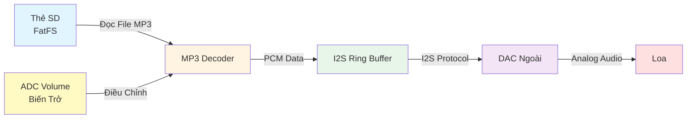
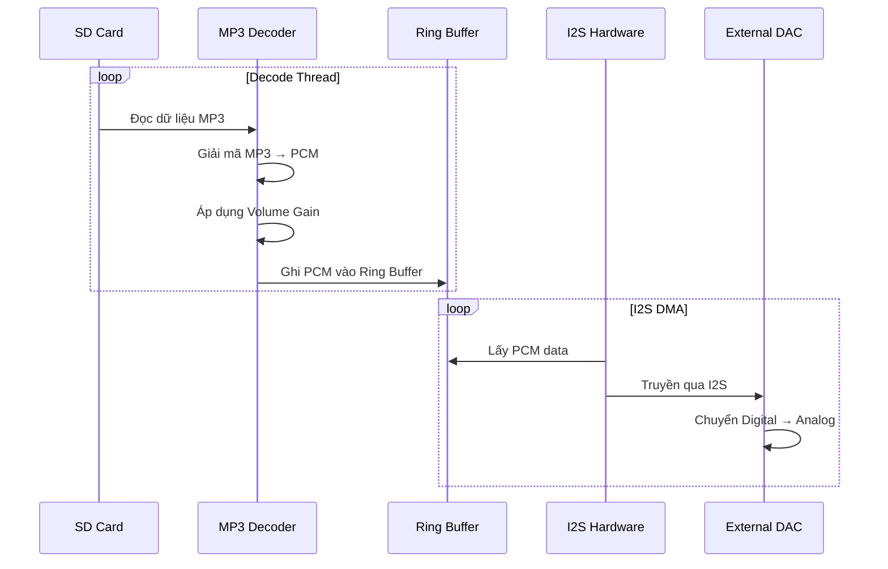
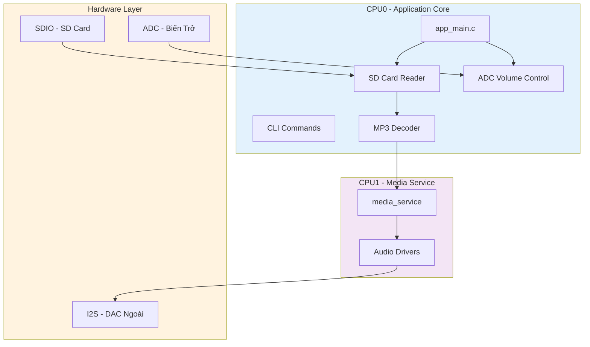

# Phát Nhạc MP3 từ Thẻ SD qua I2S - BK7258

Dự án phát file âm thanh MP3 từ thẻ SD Card thông qua giao tiếp I2S trên chip BK7258.

## Tổng Quan

Dự án này minh họa cách phát nhạc MP3 từ thẻ nhớ SD thông qua giao tiếp I2S với DAC ngoài trên chip BK7258. Hệ thống bao gồm:

- 🎵 Đọc file MP3 từ thẻ SD Card (FatFS)
- 🔊 Giải mã MP3 thành dữ liệu PCM
- 📡 Xuất âm thanh qua I2S với DAC bên ngoài
- 🎚️ Điều chỉnh âm lượng qua ADC (biến trở)

### Kiến Trúc Hệ Thống



### Luồng Xử Lý



---

## Yêu Cầu Phần Cứng

### Board BK7258
- **Chip:** BK7258 (QFN88 package)
- **PSRAM:** 8MB hoặc 16MB
- **Dual Core:** CPU0 (đọc file, giải mã) + CPU1 (media service)

### Thẻ SD Card
- **Định dạng:** FAT32
- **Kết nối:** SDIO interface
- **Dung lượng:** Tùy ý (khuyến nghị ≤32GB để tương thích FAT32)

### DAC I2S Bên Ngoài
- **Giao tiếp:** I2S (Master mode từ BK7258)
- **GPIO sử dụng:** GPIO Group 2 (GPIO44-47)
  - GPIO44: MCLK (Master Clock)
  - GPIO45: BCLK (Bit Clock)
  - GPIO46: LRCK (Left/Right Clock)
  - GPIO47: DIN (Data Input to DAC)

#### Sơ Đồ Đấu Nối Stereo Mode với 1 I2S

```
┌─────────────────────────────────────────────────────────────────────┐
│                           BK7258 Board                              │
│                                                                     │
│  GPIO44 (MCLK)  ────────────────────────┐                          │
│  GPIO45 (BCLK)  ──────────────────┐     │                          │
│  GPIO46 (LRCK)  ────────────┐     │     │                          │
│  GPIO47 (DIN)   ──────┐     │     │     │                          │
│  GND            ───┐  │     │     │     │                          │
│  3.3V/5V        ─┐ │  │     │     │     │                          │
└──────────────────┼─┼──┼─────┼─────┼─────┼──────────────────────────┘
                   │ │  │     │     │     │
                   │ │  │     │     │     │
                   │ │  │     │     │     │
┌──────────────────┼─┼──┼─────┼─────┼─────┼──────────────────────────┐
│                  │ │  │     │     │     │   I2S DAC Module         │
│                  │ │  │     │     │     │   (VD: PCM5102/MAX98357) │
│                  │ │  │     │     │     │                          │
│  VCC   ──────────┘ │  │     │     │     │  ┌────────────────┐     │
│  GND   ────────────┘  │     │     │     │  │   DAC Chip     │     │
│  DIN   ───────────────┘     │     │     │  │                │     │
│  LRCK  ─────────────────────┘     │     │  │  Left Ch  ──────────▶ Loa Trái
│  BCLK  ───────────────────────────┘     │  │  Right Ch ──────────▶ Loa Phải
│  MCLK  (optional) ───────────────────────┘  │                │     │
│                                             └────────────────┘     │
└─────────────────────────────────────────────────────────────────────┘
```

**Giải thích đấu nối:**

| Pin BK7258 | Chức Năng | Kết nối đến | Mô tả |
|------------|-----------|-------------|-------|
| **GPIO44** | MCLK | DAC MCLK (nếu có) | Master Clock (tùy chọn, một số DAC không cần) |
| **GPIO45** | BCLK | DAC BCLK/SCK | Bit Clock - đồng bộ từng bit dữ liệu |
| **GPIO46** | LRCK | DAC LRCK/WS | Left/Right Clock - phân biệt kênh trái/phải |
| **GPIO47** | DIN | DAC DIN/SD | Serial Data - dữ liệu âm thanh stereo |
| **3.3V/5V** | Power | DAC VCC | Nguồn điện (kiểm tra datasheet DAC) |
| **GND** | Ground | DAC GND | Mass chung |

**Cơ chế Stereo với 1 I2S:**
- **LRCK = 0 (LOW):** Truyền dữ liệu kênh **Left** 
- **LRCK = 1 (HIGH):** Truyền dữ liệu kênh **Right**
- Dữ liệu stereo được **time-multiplexed** (ghép kênh theo thời gian) trên cùng 1 dây DIN
- DAC tự động tách ra thành 2 kênh analog output (Left & Right)

**DAC Module Tương thích:**
- ✅ **PCM5102/PCM5102A** - 32-bit, 384kHz, I2S/Left-Justified
- ✅ **MAX98357A** - Class D Amp với I2S input (có sẵn ampli)
- ✅ **UDA1334A** - 16/24-bit stereo DAC
- ✅ **CS4344** - 24-bit stereo DAC

> **💡 Lưu ý quan trọng:**
> - Một số DAC như PCM5102 có thể tự sinh MCLK nội bộ → không cần kết nối GPIO44
> - Kiểm tra điện áp logic của DAC (3.3V hay 5V) để tránh hỏng GPIO
> - Nối GND chung giữa BK7258 và DAC để tránh nhiễu
> - Dây tín hiệu I2S nên ngắn (< 10cm) để giảm nhiễu

### ADC Volume Control (Tùy Chọn)
- **Channel:** ADC_14
- **Biến trở:** 10kΩ (nối giữa 3.3V và GND, chân giữa vào ADC_14)
- **Mức điều chỉnh:**
  - 4000-5000 (raw) → 25% volume
  - 2500-3000 → 50% volume
  - 1000-2000 → 75% volume
  - >8000 → 100% volume

---

## Hướng Dẫn Build và Chạy

### 1. Build Project

```bash
cd /path/to/bk_avdk

# Build cho BK7258
make bk7258 PROJECT=media/audio_play_sdcard_i2s

# Firmware sẽ được tạo tại:
# build/audio_play_sdcard_i2s/bk7258/all-app.bin
```

### 2. Chuẩn Bị Thẻ SD

1. **Format thẻ SD** sang định dạng **FAT32**
2. Copy file MP3 vào thư mục gốc của thẻ SD (ví dụ: `test_320kbps.mp3`)
3. Lắp thẻ SD vào board BK7258

> **📝 Lưu ý:** File MP3 hỗ trợ các sample rate: 8kHz, 11.025kHz, 12kHz, 16kHz, 22.05kHz, 24kHz, 32kHz, 44.1kHz, 48kHz, 88.2kHz, 96kHz

### 3. Flash Firmware

```bash
# Sử dụng công cụ flash của Beken
# Hoặc dùng lệnh make để flash trực tiếp
make flash
```

### 4. Chạy Demo

Sau khi flash xong, hệ thống sẽ **tự động phát file** `test_320kbps.mp3` (được cấu hình trong `app_main.c` dòng 216).

#### Sử dụng CLI để Điều Khiển

Mở Serial Terminal (115200 baud):

```bash
# Bắt đầu phát file MP3
audio_play_sdcard_i2s start ten_file.mp3

# Dừng phát nhạc
audio_play_sdcard_i2s stop
```

---

## Cấu Trúc Code

### Files Chính

```
audio_play_sdcard_i2s/
├── main/
│   ├── app_main.c          # Khởi tạo hệ thống, CLI commands, ADC volume
│   ├── audio_play.c        # Logic phát nhạc I2S + MP3 decode
│   ├── audio_play.h        # Header file API
│   ├── vendor_flash.c      # Flash partition management
│   └── CMakeLists.txt
├── config/
│   ├── bk7258/            # Cấu hình CPU0
│   └── bk7258_cp1/        # Cấu hình CPU1
├── CMakeLists.txt         # Build configuration
├── pj_config.mk          # Dual-core build settings
└── README.md             # Tài liệu này
```

### Kiến Trúc Dual-Core



---

## Chi Tiết Kỹ Thuật

### 1. Khởi Tạo I2S ([audio_play.c:445-505](file:///home/do_lumi/armino-avdk/bk_avdk/projects/media/audio_play_sdcard_i2s/main/audio_play.c#L445-L505))

```c
// Initialize I2S driver
bk_i2s_driver_init();

// Configure I2S
i2s_config_t i2s_config = DEFAULT_I2S_CONFIG();
i2s_config.role = I2S_ROLE_MASTER;           // BK7258 là Master
i2s_config.work_mode = I2S_WORK_MODE_I2S;    // Chế độ I2S chuẩn
i2s_config.samp_rate = I2S_SAMP_RATE_44100;  // 44.1kHz (sẽ điều chỉnh sau)
i2s_config.data_length = 16;                 // 16-bit audio
i2s_config.store_mode = I2S_LRCOM_STORE_16R16L; // Stereo

// Init với GPIO Group 2 (GPIO44-47)
bk_i2s_init(I2S_GPIO_GROUP_2, &i2s_config);

// Init DMA channel với Ring Buffer
bk_i2s_chl_init(I2S_CHANNEL_1,              // Channel 1
                I2S_TXRX_TYPE_TX,           // TX mode
                16384 * 4,                  // Ring buffer 64KB
                i2s_tx_data_callback,       // Callback khi cần data
                &audio_play_info->i2s_tx_rb);
```

**Giải thích:**
- **I2S Master Mode:** BK7258 tạo tất cả clock signals (MCLK, BCLK, LRCK)
- **Ring Buffer Size:** 64KB để chứa đủ PCM data, tránh underrun
- **GPIO Group 2:** GPIO44-47 được cấu hình làm I2S pins

### 2. MP3 Decode và Volume Control ([audio_play.c:137-245](file:///home/do_lumi/armino-avdk/bk_avdk/projects/media/audio_play_sdcard_i2s/main/audio_play.c#L137-L245))

```c
static bk_err_t mp3_decode_handler(unsigned int size)
{
    // 1. Đọc dữ liệu từ SD Card vào buffer
    if (audio_play_info->bytesLeft < MAINBUF_SIZE) {
        os_memmove(audio_play_info->readBuf, audio_play_info->g_readptr, 
                   audio_play_info->bytesLeft);
        f_read(&audio_play_info->mp3file, 
               audio_play_info->readBuf + audio_play_info->bytesLeft,
               MAINBUF_SIZE - audio_play_info->bytesLeft, &uiTemp);
        audio_play_info->bytesLeft += uiTemp;
        audio_play_info->g_readptr = audio_play_info->readBuf;
    }
    
    // 2. Tìm MP3 sync word
    int offset = MP3FindSyncWord(audio_play_info->g_readptr, 
                                 audio_play_info->bytesLeft);
    
    // 3. Giải mã MP3 frame → PCM
    ret = MP3Decode(audio_play_info->hMP3Decoder, 
                   &audio_play_info->g_readptr,
                   &audio_play_info->bytesLeft, 
                   audio_play_info->pcmBuf, 0);
    
    // 4. Áp dụng Volume Control (Software Gain)
    int samples = audio_play_info->mp3FrameInfo.outputSamps;
    int16_t *pcm_ptr = (int16_t *)audio_play_info->pcmBuf;
    
    for (int i = 0; i < samples; i++) {
        pcm_ptr[i] = (int16_t)(pcm_ptr[i] * gain);  // gain = 0.25 ~ 1.0
    }
    
    // 5. Ghi PCM vào I2S Ring Buffer (blocking write để tránh mất data)
    uint32_t pcm_size = audio_play_info->mp3FrameInfo.outputSamps * 2;
    uint8_t *write_ptr = (uint8_t *)audio_play_info->pcmBuf;
    uint32_t total_written = 0;
    
    while (total_written < pcm_size) {
        uint32_t written = ring_buffer_write(audio_play_info->i2s_tx_rb,
                                             write_ptr + total_written,
                                             pcm_size - total_written);
        total_written += written;
        
        if (total_written < pcm_size) {
            rtos_delay_milliseconds(2);  // Chờ I2S tiêu thụ dữ liệu
        }
    }
    
    return BK_OK;
}
```

**Luồng xử lý:**
1. **Refill buffer:** Đọc thêm dữ liệu từ SD Card khi buffer sắp hết
2. **Tìm sync word:** Xác định vị trí bắt đầu của MP3 frame
3. **Decode:** Giải mã MP3 → PCM 16-bit
4. **Volume control:** Nhân mỗi sample với hệ số `gain` (0.25 - 1.0)
5. **Blocking write:** Ghi vào ring buffer, chờ nếu buffer đầy

### 3. Decode Thread ([audio_play.c:337-364](file:///home/do_lumi/armino-avdk/bk_avdk/projects/media/audio_play_sdcard_i2s/main/audio_play.c#L337-L364))

```c
static void audio_decode_thread(void *arg)
{
    BK_LOGI(TAG, "Decode thread started\n");
    
    while (audio_play_info && audio_play_info->decode_thread_running) {
        if (audio_play_info->mp3_file_is_empty) {
            // File đã hết
            rtos_delay_milliseconds(100);
            break;
        }
        
        // Decode một MP3 frame và ghi vào ring buffer
        bk_err_t ret = mp3_decode_handler(0);
        if (ret != BK_OK) {
            rtos_delay_milliseconds(5);
            continue;
        }
        
        // Sleep ngắn để tránh busy loop
        rtos_delay_milliseconds(2);
    }
    
    BK_LOGI(TAG, "Decode thread exiting\n");
    audio_play_info->decode_thread_running = false;
    audio_play_info->decode_thread = NULL;
    rtos_delete_thread(NULL);
}
```

**Tại sao cần Decode Thread riêng?**
- I2S DMA callback (`i2s_tx_data_callback`) **không nên** làm công việc nặng
- Decode MP3 cần thời gian → nên chạy trong thread riêng
- Thread này liên tục decode và fill ring buffer
- I2S DMA tự động lấy data từ ring buffer để phát

### 4. ADC Volume Control ([app_main.c:33-128](file:///home/do_lumi/armino-avdk/bk_avdk/projects/media/audio_play_sdcard_i2s/main/app_main.c#L33-L128))

```c
void adc_simple_task(void *arg)
{
    uint16_t adc_raw_value = 0;
    
    // Cấu hình ADC channel 14
    bk_adc_driver_init();
    bk_adc_acquire();
    bk_adc_init(ADC_DETECT_CHANNEL_14);
    
    adc_config_t config = {0};
    config.chan = ADC_DETECT_CHANNEL_14;
    config.adc_mode = ADC_CONTINUOUS_MODE;
    config.src_clk = ADC_SCLK_XTAL_26M;
    config.clk = 75000;
    config.sample_rate = 32;
    bk_adc_set_config(&config);
    
    bk_adc_start();
    
    while (1) {
        // Đọc giá trị ADC
        bk_adc_read(&adc_raw_value, ADC_READ_TIMEOUT);
        
        // Điều chỉnh gain theo giá trị ADC
        if (adc_raw_value > 4000 && adc_raw_value < 5000) {
            gain = 0.25;  // 25% volume
        } else if (adc_raw_value > 2500 && adc_raw_value < 3000) {
            gain = 0.5;   // 50% volume
        } else if (adc_raw_value > 1000 && adc_raw_value < 2000) {
            gain = 0.75;  // 75% volume
        } else if (adc_raw_value > 8000) {
            gain = 1.0;   // 100% volume
        }
        
        rtos_delay_milliseconds(500);  // Đọc mỗi 500ms
    }
}
```

**Nguyên lý:**
- Biến trở tạo điện áp analog (0V - 3.3V)
- ADC đọc và chuyển thành giá trị digital (0 - 4095)
- Biến toàn cục `gain` được cập nhật
- `mp3_decode_handler()` áp dụng `gain` vào mỗi PCM sample

---

## API Reference

### I2S Driver APIs

| API | Mô Tả |
|-----|-------|
| `bk_i2s_driver_init()` | Khởi tạo I2S driver |
| `bk_i2s_init(gpio_group, config)` | Cấu hình I2S với GPIO group |
| `bk_i2s_chl_init(channel, tx/rx, size, callback, rb)` | Khởi tạo DMA channel với ring buffer |
| `bk_i2s_set_samp_rate(rate)` | Thay đổi sample rate |
| `bk_i2s_start()` | Bắt đầu I2S transmission |
| `bk_i2s_stop()` | Dừng I2S |
| `bk_i2s_chl_deinit()` | Giải phóng DMA channel |
| `bk_i2s_deinit()` | Deinit I2S |
| `bk_i2s_driver_deinit()` | Deinit I2S driver |

### MP3 Decoder APIs

| API | Mô Tả |
|-----|-------|
| `MP3InitDecoder()` | Tạo MP3 decoder instance |
| `MP3FindSyncWord(data, size)` | Tìm MP3 frame sync word |
| `MP3Decode(decoder, &data, &size, pcm_out, 0)` | Giải mã một MP3 frame |
| `MP3GetLastFrameInfo(decoder, &info)` | Lấy thông tin frame vừa decode |
| `MP3FreeDecoder(decoder)` | Giải phóng decoder |

### FatFS APIs

| API | Mô Tả |
|-----|-------|
| `f_mount(pfs, "1:", 1)` | Mount thẻ SD |
| `f_open(&file, path, mode)` | Mở file |
| `f_read(&file, buffer, size, &read)` | Đọc dữ liệu |
| `f_lseek(&file, offset)` | Di chuyển con trỏ file |
| `f_close(&file)` | Đóng file |
| `f_unmount(disk, "1:", 1)` | Unmount thẻ SD |

---

## Cấu Hình GPIO I2S

### GPIO Group Options

Có 3 GPIO groups có thể dùng cho I2S (thay đổi tại [audio_play.c:461](file:///home/do_lumi/armino-avdk/bk_avdk/projects/media/audio_play_sdcard_i2s/main/audio_play.c#L461)):

| GPIO Group | MCLK | BCLK | LRCK | DIN |
|------------|------|------|------|-----|
| `I2S_GPIO_GROUP_0` | GPIO6 | GPIO7 | GPIO8 | GPIO9 |
| `I2S_GPIO_GROUP_1` | GPIO40 | GPIO41 | GPIO42 | GPIO43 |
| `I2S_GPIO_GROUP_2` | GPIO44 | GPIO45 | GPIO46 | GPIO47 |

**Hiện tại project dùng GROUP_2** (GPIO44-47).

Để thay đổi, sửa dòng này trong `audio_play.c`:

```c
// Thay đổi từ GROUP_2 → GROUP_0 hoặc GROUP_1
ret = bk_i2s_init(I2S_GPIO_GROUP_0, &i2s_config);
```

---

## Troubleshooting

### 1. Không Nghe Thấy Âm Thanh

**Kiểm tra:**
- ✅ Đã kết nối đúng DAC I2S với GPIO44-47?
- ✅ DAC có được cấp nguồn chưa?
- ✅ File MP3 có tồn tại trên thẻ SD?
- ✅ Thẻ SD đã được mount thành công? (xem log)
- ✅ Biến trở điều chỉnh volume có đang ở mức quá thấp?

**Debug steps:**
```bash
# Xem log để kiểm tra
# - "f_mount OK!" → SD card mounted
# - "mp3 file: XXX open successful" → File đã mở
# - "I2S configured: 44100 Hz, 2 channels" → I2S đã init
# - "I2S playback started successfully" → I2S đã start
# - "Decode thread started" → Thread đang chạy
```

### 2. Âm Thanh Bị Giật, Lag

**Nguyên nhân:**
- Ring buffer quá nhỏ
- SD Card đọc chậm
- CPU load quá cao

**Giải pháp:**
- Tăng ring buffer size tại [audio_play.c:470](file:///home/do_lumi/armino-avdk/bk_avdk/projects/media/audio_play_sdcard_i2s/main/audio_play.c#L470):
  ```c
  bk_i2s_chl_init(I2S_CHANNEL_1, I2S_TXRX_TYPE_TX, 
                  32768 * 4,  // Tăng từ 16384*4 → 32768*4
                  i2s_tx_data_callback, &audio_play_info->i2s_tx_rb);
  ```
- Giảm delay trong decode thread (nhưng tăng CPU usage):
  ```c
  rtos_delay_milliseconds(1);  // Giảm từ 2ms → 1ms
  ```

### 3. File MP3 Không Phát Được

**Kiểm tra:**
- File có ID3 tag lớn? → Code đã xử lý skip ID3
- File MP3 có bị corrupt?
- Sample rate có được hỗ trợ không? (8k-96kHz)

**Thử:**
```bash
# Chuyển file MP3 sang format đơn giản hơn
ffmpeg -i input.mp3 -ar 44100 -ac 2 -b:a 128k output.mp3
```

### 4. "Ring Buffer Full" Warning

**Log:**
```
[WARN] i2s tx data send, size = XXX
```

**Nguyên nhân:**
- Decode quá nhanh, I2S chưa kịp phát
- Code đã xử lý: blocking write + wait

**Nếu vẫn xảy ra:**
- Kiểm tra I2S clock có chạy đúng không
- Kiểm tra DAC có đang tiêu thụ data không

### 5. Thay Đổi GPIO Cho SDIO

Nếu GPIO SDIO conflict với I2S:
- Xem file `middleware/driver/sdio_host/sdio_driver.c`
- Hoặc `middleware/driver/sdio_host/sdio_host_driver.c`
- Tìm section cấu hình GPIO cho BK7258 và thay đổi

---

## Mở Rộng và Tùy Chỉnh

### 1. Thay Đổi Sample Rate Mặc Định

Mặc định là 44.1kHz, để thay đổi:

```c
// Tại audio_play.c:456
i2s_config.samp_rate = I2S_SAMP_RATE_48000;  // 48kHz
```

### 2. Thay Đổi File Tự Động Phát

```c
// Tại app_main.c:216
audio_play_sdcard_i2s_start("your_song.mp3");
```

### 3. Tắt ADC Volume Control

Nếu không dùng biến trở:

```c
// Comment out dòng này trong app_main.c:220-225
// rtos_create_thread(..., adc_simple_task, ...);
```

Và set gain cố định:

```c
// Trong audio_play.c:33
float gain = 0.5f;  // 50% volume cố định
```

### 4. Thêm Hỗ Trợ WAV/FLAC/AAC

1. Thêm decoder tương ứng vào dependencies
2. Sửa `mp3_decode_handler()` để phát hiện format file
3. Gọi decoder phù hợp dựa trên extension

---

## Tài Liệu Tham Khảo

### Header Files Quan Trọng

- [driver/i2s.h](file:///home/do_lumi/armino-avdk/bk_avdk/middleware/driver/i2s/i2s_driver.c) - I2S Driver APIs
- [driver/audio_ring_buff.h](file:///home/do_lumi/armino-avdk/bk_avdk/middleware/driver/audio_ring_buff/audio_ring_buff.c) - Ring Buffer APIs
- [modules/mp3dec.h](file:///home/do_lumi/armino-avdk/bk_avdk/include/modules/mp3dec.h) - MP3 Decoder APIs
- [ff.h](file:///home/do_lumi/armino-avdk/bk_avdk/components/fatfs/ff.h) - FatFS APIs

### Code Files

- [audio_play.c](file:///home/do_lumi/armino-avdk/bk_avdk/projects/media/audio_play_sdcard_i2s/main/audio_play.c) - Logic chính phát nhạc I2S
- [app_main.c](file:///home/do_lumi/armino-avdk/bk_avdk/projects/media/audio_play_sdcard_i2s/main/app_main.c) - CLI và ADC volume control

---

## Changelog

### Version hiện tại (I2S Implementation)

- ✅ Phát MP3 qua I2S với DAC ngoài
- ✅ Hỗ trợ GPIO Group 2 (GPIO44-47)
- ✅ Ring buffer 64KB để tránh underrun
- ✅ Decode thread riêng để xử lý MP3
- ✅ ADC volume control với biến trở
- ✅ Software gain control (0.25x - 1.0x)
- ✅ Blocking write để tránh mất data
- ✅ Auto skip ID3 tags
- ✅ CLI commands để điều khiển

### So với Version DAC Cũ

| Feature | DAC Version | I2S Version (Hiện tại) |
|---------|-------------|------------------------|
| Output | Internal DAC (AOP/AON) | External I2S DAC |
| Audio Quality | Thấp hơn | Cao hơn (tùy DAC) |
| GPIO Usage | 2 pins (AOP, AON) | 4 pins (MCLK, BCLK, LRCK, DIN) |
| API Layer | `aud_intf` (high-level) | `bk_i2s_*` (low-level) |
| Flexibility | Giới hạn | Cao (chọn DAC tùy ý) |

---

## Tác Giả & License

**Project:** audio_play_sdcard_i2s  
**Platform:** BK7258 (Beken AVDK)  
**License:** Apache License 2.0  
**Documentation:** Tiếng Việt (Vietnamese)

---

## Hỗ Trợ

Nếu gặp vấn đề, vui lòng:
1. Kiểm tra phần Troubleshooting ở trên
2. Xem lại log trong Serial Terminal
3. Kiểm tra kết nối phần cứng
4. Đảm bảo file MP3 hợp lệ

**Happy Coding! 🎵**
