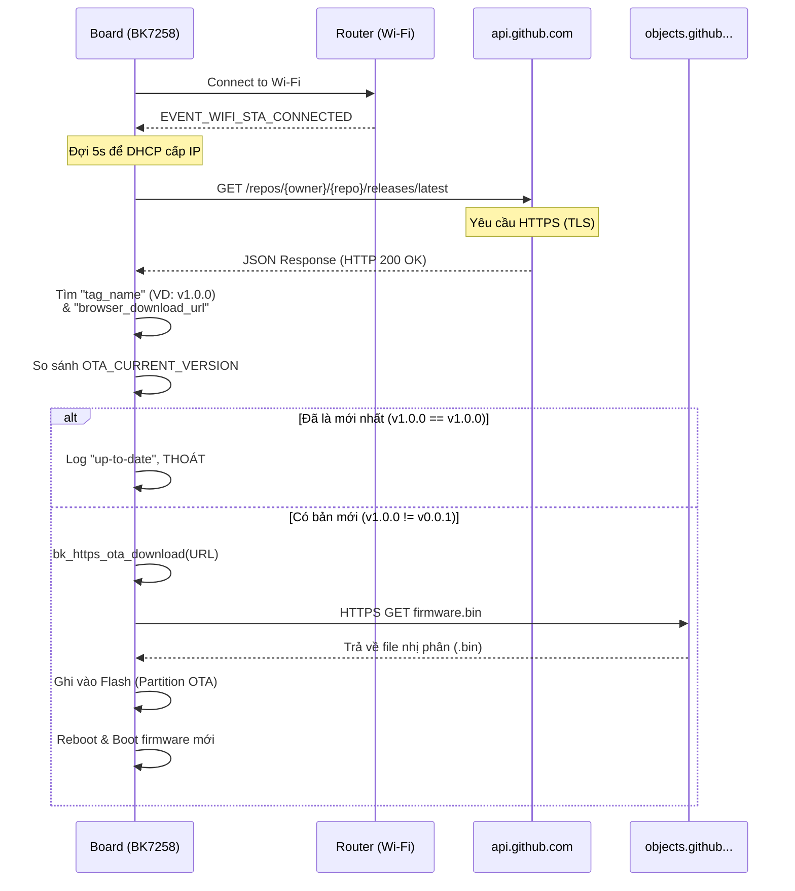

# Hướng dẫn Tích hợp và Sử dụng OTA qua GitHub (HTTPS)

Dự án [audio_play_sdcard_i2s](file:///home/do30032003/bk_avdk/projects/media/audio_play_sdcard_i2s/main/app_main.c#316-340) đã được tích hợp module [ota_github](file:///home/do30032003/bk_avdk/projects/media/audio_play_sdcard_i2s/main/ota_github.c#243-291) cho phép thiết bị (BK7258) tự động tải và cập nhật firmware trực tiếp từ **GitHub Releases**. 

Tài liệu này mô tả chi tiết luồng hoạt động của code đang triển khai và hướng dẫn cách thiết lập trên GitHub để OTA hoạt động thành công.

---

## 1. Luồng hoạt động (Sequence Diagram)

OTA task sẽ tự động được kích hoạt ngay khi thiết bị kết nối thành công vào mạng Wi-Fi (nhận được `EVENT_WIFI_STA_CONNECTED`).



### Chi tiết các bước trong code ([ota_github.c](file:///home/do30032003/bk_avdk/projects/media/audio_play_sdcard_i2s/main/ota_github.c))
1. **Trigger:** Hàm [wifi_event_handler](file:///home/do30032003/bk_avdk/projects/media/audio_play_sdcard_i2s/main/app_main.c#363-373) ([app_main.c](file:///home/do30032003/bk_avdk/projects/media/audio_play_sdcard_i2s/main/app_main.c)) bắt sự kiện Wi-Fi Connected và gọi [ota_github_start()](file:///home/do30032003/bk_avdk/projects/media/audio_play_sdcard_i2s/main/ota_github.c#292-311).
2. **Delay IPs:** Task OTA bắt đầu bằng `rtos_delay_milliseconds(5000)` để đợi Router cấp IP (DHCP).
3. **Query GitHub API:** Thiết bị sử dụng HTTP Client của Beken (`bk_http_client_perform`) gọi đến endpoint `https://api.github.com/repos/<owner>/<repo>/releases/latest`. API này yêu cầu xác thực SSL/TLS bằng CA Cert của DigiCert (đã nhúng sẵn trong code).
4. **Parsing JSON:** Không dùng cJSON nặng nề, module quét chuỗi (string pattern matching) tìm trường `"tag_name":"` và `"browser_download_url":"` của asset `app.bin`.
5. **Download & Flash:** Gọi API cốt lõi [bk_https_ota_download(url)](file:///home/do30032003/bk_avdk/bk_idk/components/ota/ota_https.c#152-231). API này sẽ tải binary stream ghi thẳng vào vùng nhớ [ota](file:///home/do30032003/bk_avdk/bk_idk/components/bk_cli/cli_ota.c#165-172) trên Flash (vị trí `0x286000`). Nếu tải xong sẽ tự động gọi `bk_reboot()`.

---

## 2. Giải thích lỗi 404 (Not Found) trong Log

Trong log mà bạn đã chạy:
```
HTTPS:E(11576):Error, http status code: 404
...
OTA_GH:E(11580):Parse tag_name failed
```
Thiết bị đã kết nối thành công đến API của GitHub (`ssl_handshake done`, `mbedtls_ssl_write`), nhưng GitHub trả về mã lỗi **404 Not Found**. Nguyên nhân 100% đến từ việc cấu hình trên GitHub chưa đúng hoặc thông tin repo điền trong code bị sai. 

API GitHub sẽ trả về 404 nếu:
- `OTA_GITHUB_OWNER` hoặc `OTA_GITHUB_REPO` trong code không tồn tại.
- Repository đang để chế độ **Private** (với Private repo cần phải gửi kèm Personal Access Token trong header HTTP).
- Repository chưa có **bất kỳ Release nào** được publish.

---

## 3. Hướng dẫn thiết lập (Setup) trên GitHub

Để OTA hoạt động thành công, bạn phải làm theo đúng trình tự sau:

### Bước 3.1: Config trong mã nguồn (Code)
Mở file [main/ota_github.h](file:///home/do30032003/bk_avdk/projects/media/audio_play_sdcard_i2s/main/ota_github.h) và cấu hình chính xác vào Repository public của bạn:

```c
#define OTA_CURRENT_VERSION      "v0.0.1"          // Lúc test, bạn phải giữ version thấp
#define OTA_GITHUB_OWNER         "ten-user-github" // VD: "do30032003"
#define OTA_GITHUB_REPO          "ten-repo"        // VD: "my-bk7258-project"
#define OTA_FIRMWARE_ASSET_NAME  "app.bin"         // Phải khớp tên file lúc up lên Release
```

### Bước 3.2: Tạo GitHub Release

Tất cả OTA phụ thuộc vào tính năng **Releases** của GitHub. Thiết bị luôn lấy bản release mới nhất (Latest Release).

1. Build firmware (để có file `.bin`)
2. Truy cập vào Repository của bạn trên trình duyệt (Repo phải là **Public**).
3. Nhìn sang cột bên nhấp vào **Releases** \> **Draft a new release**.
4. Chọn **Choose a tag**: gõ `v1.0.0` (Bạn muốn cập nhật lên bản tĩnh nào thì điền). Chữ `v` hay không không quan trọng, miễn là khác `OTA_CURRENT_VERSION` trong source code hiện tại đang chạy trên mạch.
5. Ở mục tiêu đề (Release title) nhập tuỳ ý (VD: `Phiên bản OTA đầu tiên`).
6. **QUAN TRỌNG:** Ở hộp **Attach binaries by dropping them here...**: Kéo thả file firmware `app.bin` (hoặc tên file build ra) vào đây.
   > *Lưu ý: Tên file bạn upload lên phải GIỐNG HỆT giá trị `OTA_FIRMWARE_ASSET_NAME` ("app.bin").*
7. Nhấn **Publish release** (màu xanh lá).

### Bước 3.3: Verify bằng Web
Trước khi chạy trên board, Mở trình duyệt web và dán đường link sau:
```
https://api.github.com/repos/<ten-user-github>/<ten-repo>/releases/latest
```
*(Thay đúng owner/repo của bạn)*.
Nếu thấy màn hình trả về JSON, có `"tag_name": "v1.0.0"` và phía dưới `assets` có tên `app.bin` với `browser_download_url` → **Bạn đã setup thành công!** Lúc này chạy board sẽ không còn lỗi 404.

---

## 4. Bảo mật và CA Certificate

Hiện tại API `api.github.com` dùng chứng chỉ (cert) của DigiCert. Mã nguồn [ota_github.c](file:///home/do30032003/bk_avdk/projects/media/audio_play_sdcard_i2s/main/ota_github.c) đang chứa DigiCert Root CA dưới dạng text tĩnh:
```c
static const char s_github_ca_cert[] = "-----BEGIN CERTIFICATE-----\r\nMIIDrzC..."
```
Nếu tương lai GitHub thay đổi nhà cung cấp chứng chỉ, đoạn code OTA sẽ báo lỗi Handshake (`mbedtls_ssl_handshake fail`). Cách cập nhật:
Bạn chạy lệnh: `openssl s_client -connect api.github.com:443 -showcerts` và copy chứng chỉ ngoài cùng (Root CA) đè vào biến `s_github_ca_cert[]` là xong.
